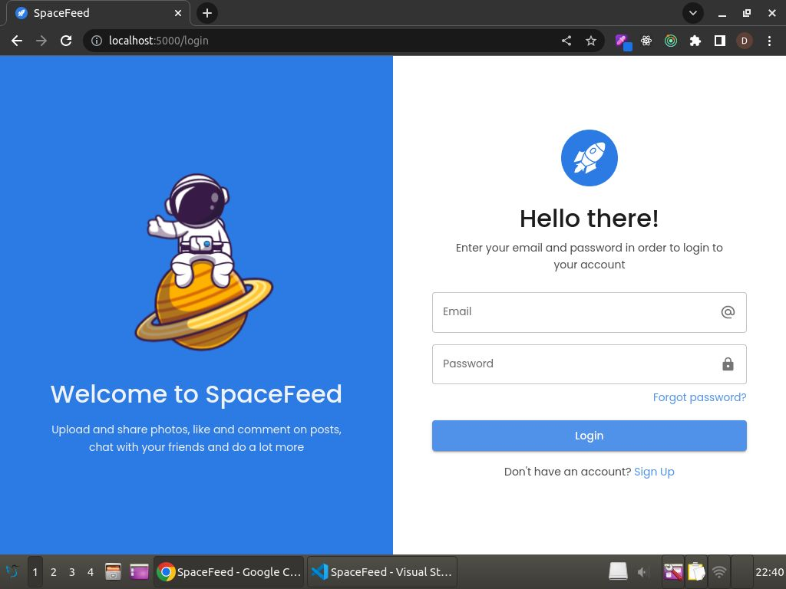

# **SpaceFeed** 

**SpaceFeed** is a social media platform where users can upload posts and images, like and comment on other people's posts, receive realtime notifications and do many other things

## About :dart:

SpaceFeed is a web app built using the MERN stack! Here, a user can create account, search and follow users, interact with their posts, share them and do a lot more!

## Demo

You can try SpaceFeed by visiting: https://spacefeed.ishantchauhan.com/

### Video Demo

[Here](https://www.youtube.com/watch?v=qTP6rp6s57w&t=50s) is a short video on how to use SpaceFeed

## Blog ✍️
To know more about how I built this project, read my article here:
https://ishantchauhan.hashnode.dev/my-debugging-adventure-fixing-bugs-in-spacefeed

## SpaceFeed Features :fire:

- **Authentication** - Users can create account using email, password, profile picture and other details
- **Create Posts** - Users can upload posts containing images
- **Interact With Posts** - Users can like, comment, share and like a particular comment on a post
- **Follow User** - Users can follow and unfollow other users
- **User Suggestions** - Users can see a list of suggested users when visiting the profile page
- **Realtime Notifications** - Users can receive instant notifications whenever someone likes or comments on their post
- **User Search** - Users can search a person using his name or email
- **News** - Users can see who commented on whom's post


## 📸 Screenshots :computer:

|   |   |   |
|---|---|---|
||  | 
| |  | 
|| | 
||  | 

## 📸 Screenshots :iphone:

|   |   |   |
|---|---|---|
||  | 
| |  | 
|| | 


## Technical details :bulb:
- The frontend of SpaceFeed is created using ReactJS and MaterialUI. SpaceFeed is highly responsive and is tested on all popular browsers like Chrome, Safari and Opera Mini. For handling the react states, Redux Toolkit is used. All the react components and file structure are properly organized.
- The backend of SpaceFeed is built using NodeJs, ExpressJs, MongoDB and Socket.io. For authentication, SpaceFeed makes use of session based authentication. For storing images, Firebase storage is used.


## Project Setup :pencil:
If you want to clone this project and customize it further, you need to do a couple of tasks first:
1) Create an account on [MongoDB Cloud](https://cloud.mongodb.com/), setup a cluster and get its [connection string](https://www.mongodb.com/docs/guides/atlas/connection-string/)
2) Create an account on [Firebase](https://firebase.google.com/), enable storage and get your [google-services.json file](https://support.google.com/firebase/answer/7015592?hl=en#zippy=%2Cin-this-article) and [bucket name](https://firebase.google.com/docs/storage/admin/start) from there
3) Clone this project. You can directly download the source code .zip file, or you can use the git clone command in terminal
4) Once successful, open your VSCode in the project folder and in terminal, write the following commands:
```
npm install
cd frontend
npm install
cd ..
```
5) After this, create a new file with the exact name of ".env"
6) In the .env file, write:<br><br>

```
PORT = 5000
MONGO_CONNECTION_STRING = --paste your cloud mondodb cluster's connection string--
FIREBASE_STORAGE_BUCKET = -- paste your firebase bucket name here eg. example.appspot.com --
SESSION_SECRET = 12345
DUMMY_USER_PASSWORD_HASH = $2a$12$QPROumv.az41u43V2nW48OQ0hhIRw7TWvEmlWknqq3EVMurBZ5YO.
NODE_ENV = development
```
7) In the root folder, paste your google-services.json file and rename it to spacefeed_firebase.json
8) You are all set up now! To start the backend server, in terminal write:
```
npm start
```
9) And to start the frontend, write:
```
cd frontend
npm start
```
10) Then write localhost:3000 in your browser to be able to use SpaceFeed!
 

## Production Build :computer:
1) To build the project for production purpose, in the .env file, change NODE_ENV to production
2) Then in terminal, write 
```
cd frontend
npm run build
cd ..
```
3) Once the build is completed, simply write npm start to run the website in production mode!

## Contact
For any queries, you can mail me at developerishant710@gmail.com


